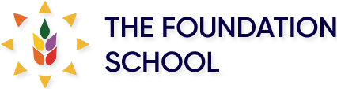

<DOCTYPE html>
<html lang="en">
    <meta charset="UTF-8">
    <meta name="viewport" content="width=device-width, initial-scale=1.0">
    <meta http-equiv="X-UA-Compatible" content="IE=edge">
    <link rel="stylesheet" href="style.css">
    
<head>
    <meta charset="UTF-8">
    <meta name="viewport" content="width=device-width, initial-scale=1.0">
    <meta http-equiv="X-UA-Compatible" content="IE=edge">
    <title>The Foundation School Model United Nations</title>
</head>
<body>
<link rel="stylesheet" href="styles.css">
<header>
    
    <h1>The Foundation School MUN 2025</h1>
    
</header>

<nav>
    <a href="#about">About</a>
    <a href="#committees">Committees</a>
    <a href="#registration">Registration</a>
    <a href="#contact">Contact</a>
</nav>

<section class="main-content" id="about">
    <h2>About Us</h2>
    <h2>Welcome to The Foundation School MUN</h2>
    
 Dear Future Leaders,
        After a long wait, we are ecstatic to welcome you to the second edition of TFSMUN.
     Initially, we started this event to educate our young minds about the most important topics and situations present in the world today; nevertheless, this hasn’t stopped us from overlooking our potential. This year, we have decided to take a step ahead and explore the different aspects and workings of such a conference.
     With a blend of innovation, inclusivity, and a commitment to fostering global awareness, our team has meticulously crafted an environment that encourages dialogue, challenges perspectives, and empowers delegates to tackle pressing global issues with creativity and diplomacy. The Organising Committee has spent countless hours putting together a wonderful conference for you all, and we hope you find it as useful as we envisioned. This edition of TFSMUN will serve as a hub of knowledge for all our delegates, and we hope all of you learn something from it. Join us as we embark on this transformative journey, forging a new tradition of excellence, cooperation, and diplomacy at this model United Nations.
    <h2>Welcome to TFSMUN 2025</h2>

</section>

<section class="main-content" id="committees">
    <h2>Committees</h2>
    <ul>
        <ol>United Nations Security Council (UNSC)</ol>
        <ol>All India Political Party Meet (AIPPM)</ol>
        <ol>United Nations Human Rights Council (UNHRC)</ol>
        <ol>Continuous Crisis Committee (CCC)</ol>
    </ul>
</section>

<section class="main-content" id="registration">
    <h2>Registrations</h2>
    
Register yourself TODAY! <a href="https://forms.gle/RY3UBcSKibWpFnNJ6">Register here</a>.

</section>

<section class="main-content" id="contact">
    <h2>Contact Us</h2>
    
Atulya Prasad:

    
    Email: atulyapras@foundationschoolindia.com

    
    Phone: +91 8050174623

    
________________________________

    
Ananya Mandalika:

    
    Email: ananyamand@foundationschoolindia.com

    
    Phone: +91 1111111111

</section>
 
 
 
<footer>
    
&copy; 2024 The Foundation School MUN | Designed by Atulya Prasad

</footer>

</body>
</html>
